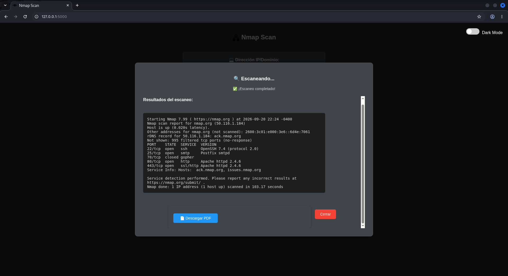
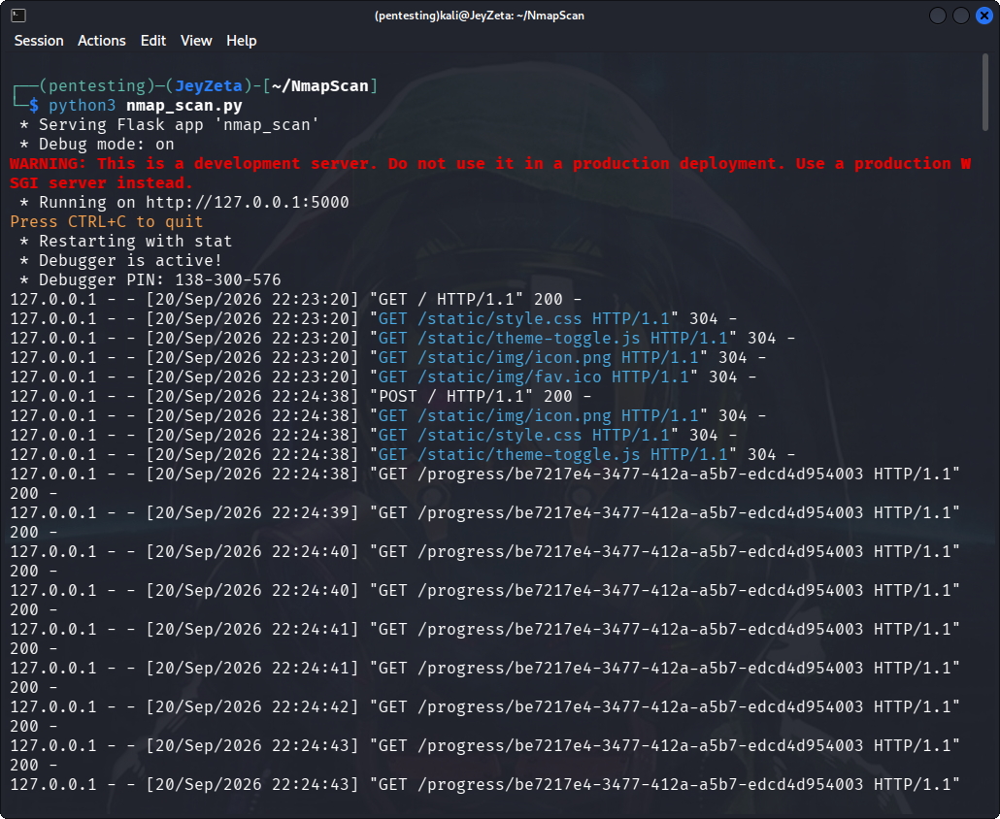
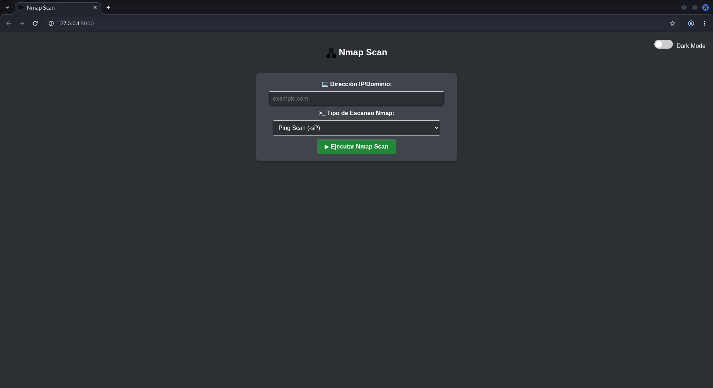
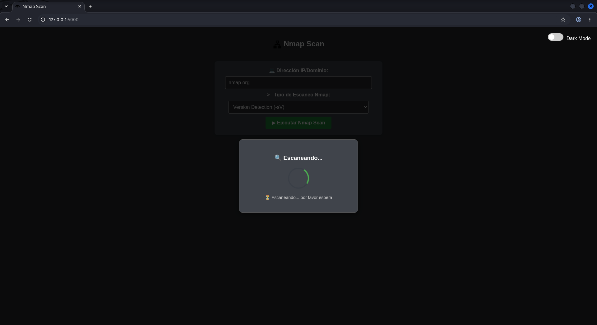
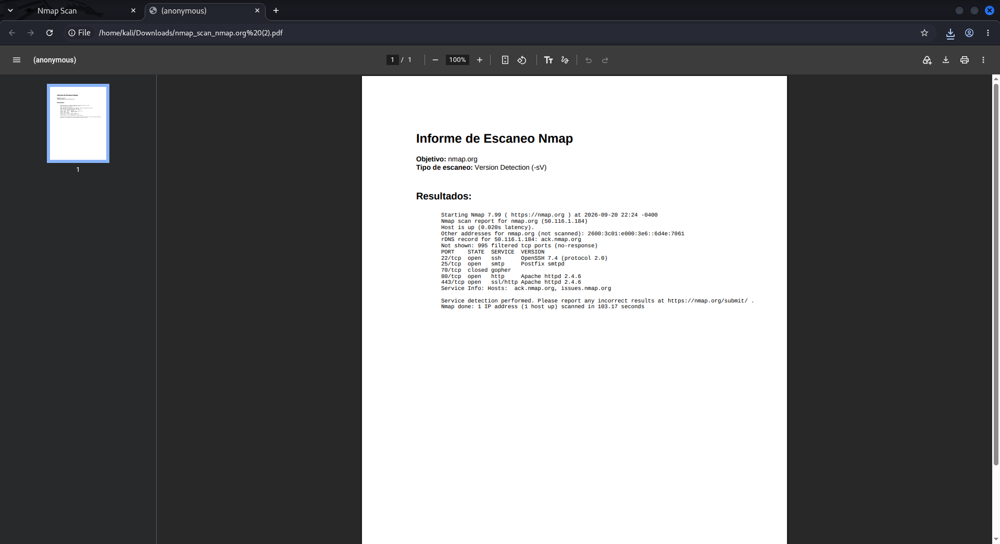

# NmapScan
Tool to use Nmap, in Flask with different types of scans. 👁

<p align="center">

</p>

<p align="center">
  
  
  
  
  
  
</p>

> **The project is open to partners.**

# SUPPORTED DISTRIBUTIONS
|Distribution | Verified version | 	Supported | 	Status |
|--------------|--------------------|------|-------|
|Kali Linux| 2026.2| ✅| Working   |
|Parrot Security OS| 6.3| ✅ | Working   |
|Windows| 11 | ✅ | Working   |
|BackBox| 9 | ✅ | Working   |
|Arch Linux| 2024.12.01 | ✅ | Working   |

# Root privileges:
To run some types of advanced scans with Nmap (such as -sS, -O, -A), sudo is required. Make sure that the user running the application has the necessary permissions or configure sudo to not prompt for a password when running Nmap (this should be done with caution).

# System Settings:
Sudo permissions without password (optional): If you want to prevent Flask from requesting the sudo password when running certain scans, you can configure sudo to allow the user to run nmap without a password:
```
sudo visudo
```
Then, add a line like the following to the end of the file (replace username with the system user name):
```
username ALL=(ALL) NOPASSWD: /usr/bin/nmap
```

# Solutions:
Run the program as sudo: Since the Flask application is running the Nmap command and it needs root permissions, a straightforward solution is to run Flask with sudo:

## Example:
```
sudo python3 nmap_scan.py
```

However, this is not the most secure solution, especially in a production environment. If you decide to use this method, make sure it is only enabled in controlled environments.

Assign specific permissions to Nmap using setcap: If you want to avoid running the entire Flask script with sudo, you can grant specific permissions to Nmap to run without needing root permissions for certain scans:
```
sudo setcap cap_net_raw,cap_net_admin,cap_net_bind_service+eip $(which nmap)
```
# USAGE
```
git clone https://github.com/HackUnderway/NmapScan.git
```
```
cd NmapScan
```
```
python3 nmap_scan.py
```
# REQUIREMENTS
```
pip install -r requirements.txt
```

<p align="center">





</p>

# SUPPORT
Questions, bugs or suggestions to : info@hackunderway.com

# LICENSE
- [x] NmapScan is licensed. 
- [x] See [LICENSE](https://github.com/HackUnderway/NmapScan#MIT-1-ov-file) for more information.

We need partners and sponsors, if you're interested in support or help contact.

# 👨‍💻 Author

* [Victor Bancayan](https://www.offsec.com/bug-bounty-program/) - (**CEO at [Hack Underway](https://hackunderway.com/)**) 

---

<h2 align="center">🕵️‍♂️ OSINT Platform</h2>
<p align="center">
  <a href="https://hackunderway.io/" target="_blank">
    
  </a>
</p>
<p align="center">
  <b>Automate OSINT processes</b><br>
  New <b>Enterprise Mode</b> – Maltego-inspired interface with visual graphs and professional workflows.<br>
  <a href="https://hackunderway.io/new-update-to-our-osint-platform-hack-underway/" target="_blank">📢 See what's new</a>
</p>

## 🔗 Links
[](https://www.patreon.com/c/HackUnderway)
[](https://hackunderway.com)
[](https://www.facebook.com/HackUnderway)
[](https://www.youtube.com/@JeyZetaOficial)
[](https://x.com/JeyZetaOficial)
[](https://instagram.com/hackunderway)
[](https://tryhackme.com/p/JeyZeta)

## ☕️ Support the project

If you like this tool, consider buying me a coffee:

[](https://www.buymeacoffee.com/hackunderway)

## 🌞 Subscriptions

###### Subscribe to: [Jey Zeta](https://www.facebook.com/JeyZetaOficial/subscribe/)

[](https://www.kali.org/)

from  made in  +  with  by: <font color="red">Victor Bancayan</font>

© 2026
